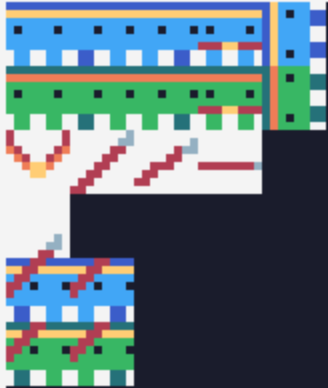
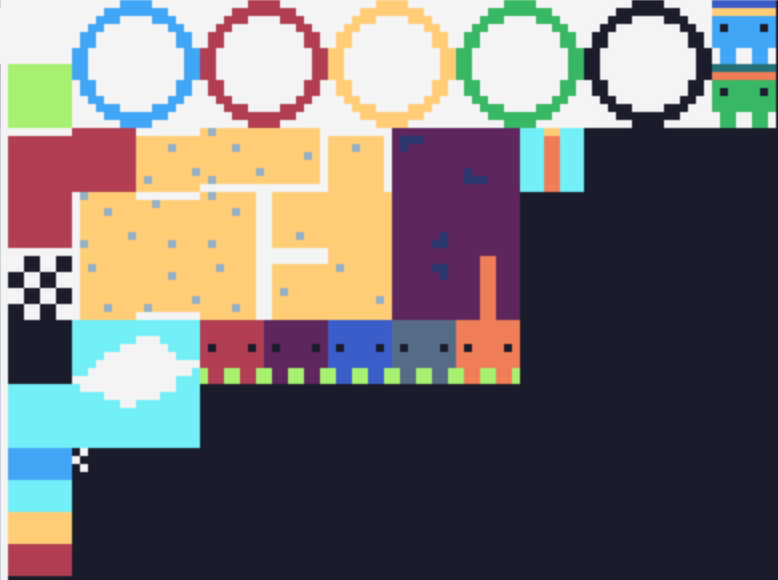

# Make Project: Bloblympics

## About Bloblympics
The inspiration for Bloblympics came from the decathlon track event, since we are both track athletes at Swarthmore. The decathlon is 10 events spread across 2 days. We were working under a time constraint for this project so we chose 4 events instead of the full 10: 100m dash, Long Jump (LJ), High Jump (HJ), and Javelin. We chose the 100m dash and only have one track event because we felt that it encompassed most of the running event mechanics and we did not want to program the same mini-game for different distances. We added HJ because that would give us the challenge of coding side-view jumping physics. Lastly, we added LJ and Javelin because Alyssa's main event is LJ and Xavier's main event is Javelin. Bloblympics is a 2-player game where players take turns completing the event series with the exception of the 100m dash which is a race where players simultaneously control their characters.

## Sprites & Tiles
<p align="center">
  
</p>

Each player is displayed as a little blob character on the screen. The blue blob is Player 1 and the green blob is Player 2. The sprite design for the blobs was inspired by Super Meat Boy, the game that we did our TIC-80 mini-platform study on. There are 2 sets of sprites, one for each player. Included in the set of sprites is one standing sprite, 2 runnig sprites, one jumping birds-eye view sprite, one medal-wearing sprite, and 2 running-with-javelin sprites. There is also a medal sprite for the medal-count page and a series of 3 javelin sprites to create the illusion that it is arcing through the air after being thrown by the blobs.

<p align="center">
  
</p>

In addition to the sprites, we created tiles that are used in map-making. These tiles are used to create the home page, 4 event pages, and medal pages. These include tiles for the Olympic rings, track surface, grass, sand, HJ equipment, sky, and power bar. Both sprites and tiles were created solely using the TIC-80 sprite editor.

## Sound
Additionally, this is our first game with sound! Our homepage features a trasncription of "Bugler's Dream" by John Williams which is the song that the NBC Olympics channel plays when the Olympics are underway. To do this, we found [a Youtube video](https://youtu.be/R9l17CxnwgM) that showed the song being played key by key and used that to help us determine the notes, tempo, and speed to create our transcription. Since the full score to Bugler's Dream is actually quite long, we opted only to transcribe the iconic opening to the song and modify it so it created a smooth loop if you stay long enough on the homepage.

## Scoring
For each event, we keep track of which blob won by updating a winner global variable within the functions that get called for each event. Winner is initialized at 0. After the win condition of said event gets satisfied, we check for which blob won the mini-game and update the winner variable accordingly. For the 100m dash, the win condition is met if one of the blobs reaches the x-coordinate of the finish line. For the other events, the win considiton is satiesfied when both players have had their turns and one player scored higher than the other. The individual scores in these events are tracked by score1 and score2 variables that get compared at the end of each event function and reset/reused when moving on to another mini-game. Winner = 1 means that Player 1 won the mini-game and winner = 2 means that Player 2 won the mini-game. Using this information, we update the medal count variables, wins1 and wins2, based on what winner equals at the end of each mini-game. Following the completion of all mini-games, a scoreboard gets displayed that shows how many medals each blob has won and crowns one of the blob as winner of the track meet based on who has more wins.

## Events
### 100m Dash
For the 100m dash, the players start at the left side of the screen, each in their own lanes. Each player runs as fast as you mash the buttons associated with their forward movement. For Player 1, press the right arrow key as fast as you can to run and for Player 2, press the space bar as fast as you can to run. With each button press for each player, their running animations are created by alternating the sprite numbers for the running sprites through modding calculation.

To get to the 100m dash, the program listens for the button X to be pressed. Upon X being pressed, one is added to the gameMode global variable that keeps track of what game and which player's turn it is. gameMode 0 signals that X has not been pressed yet so the homepage is displayed. When 1 is added on the event that X is pressed, gameMode is 1 which signifies that both players are ready to run the 100m dash. In addition to incrementing the gameMode as players complete the mini-games, the function play100() is called if gameMode is 1. Play100() is a function that calls 2 other functions, Player1100() and Player2100(), and handles the win conditions for if Player 1 reaches the finish line first or if Player 2 reaches the finish line first. Player1100() and Player2100() are nearly identical with the exception of spirte numbers and what winner is set equal to. Here are the functions for comparison:

```
function Player1100()
  if btnp(3) then
    counter1 = counter1 + 1
    counter1 = counter1 % 3
    if x1 >= 220 then
      counter1 = 0
      x1 = 220
        if winner == 0 then
	  sprite1 = 259
	  winner = 1
	end
        else
	  x1 = x1 + 4
        end
     end
   spr(sprite1+counter1,x1,y1,12,1,0,0,1,1)
end

function Player2100()
   if btnp(4) then
   counter2 = counter2 + 1
   counter2 = counter2 % 3
      if x2 >= 220 then
        x2 = 220
	counter2 = 0
	if winner == 0 then
	  sprite2 = 275
	  winner = 2
	end
	else
	  x2 = x2 + 4
	end
    end
    spr(sprite2+counter2,x2,y2,12,1,0,0,1,1)
end
``` 
Winner is another global variable that is used in the function play100() to determine which messages and which medal sprite to draw once one of the players reaches the finish line. If Player 1 reaches the finish line first, the Player 1 medal sprite will be drawn at the finish line with text printed across the track that says "PLAYER 1 WINS!". If Player 2 reaches the finish line first, the Player 2 medal sprite will be drawn at the finish line with the text "PLAYER 2 WINS!" across the track. For both win conditions, if a player has won (if the winner variable is not equal to 0), then the option to press X to increment gameMode and move to the next mini-game will appear. Below is the play100() function:

```
function play100()
 if btnp(0) then gameMode = gameMode + 1 end
   map(30,0,30,17,0,0,-1,1)
   Player1100()
   Player2100()
   if winner == 1 then
      print("PLAYER 1 WINS!",80,60,4,2)
   end
   if winner == 2 then
      print("PLAYER 2 WINS!",80,76,4,2)
   end
   if winner ~= 0 then
      print("Press X to continue",60,50,4,2)
      if btnp(6) then
         counter1 = 0
	 counter2 = 0
	 x2=0
	 y2=76
	 sprite1 = 256
	 sprite2 = 272
	 if (winner == 1) then
	    wins1 = wins1 + 1
	 end
	 if (winner == 2) then
	    wins2 = wins2 + 1
	 end
	 winner = 0
	 gameMode = 2
       end
   end
end
```

### Long Jump
After the 100m dash, the players will be transported to the long jump runway by pressing X again after they've both completed the 100m dash. As mentioned before, this increments gameMode again, making gameMode = 2. One this happens, we check if gameMode = 2 and if it does, we call the playLJ1() function. Since both players do not go simultaneously in the LJ, we opted to run the LJ code twice, one for each player's turn. In order to have this happen, we treated each player's LJ turn as a separate game mode. When gameMode = 2, it is Player 1's turn and once Player 1 finishes their turn, they press X again to increment gameMode to 3 which means that the LJ resets and places Player 2's sprite on the runway instead, signifying it is Player 2's turn. Within the playLJ1() function, we draw the LJ map and call the function PlayerLJ(1) where the parameter is the player we are calling PlayerLJ() for. Since the player parameter is 1, this calls the PlayerLJ function using the Player 1 sprites and track's the Player 1's jump distance for comparison to Player 2's jump distance later. PlayLJ2() is called after Player 1 finishes their turn and their score is saved in the global score1 variable. PlayLJ2() redraws the LJ map and calls PlayerLJ(2) which performs the same functions as for Player 1 but for Player 2's sprites and variables.

In PlayerLJ(player), we first set the landed variable to 0. The landed variable determines whether or not a player's turn has ended and defines an ended turn by if the player has landed in the sand pit or not. Next, we determine for which player sprites we should perform PlayerLJ's operations for. We then begin the LJ with an automatically played running animation for the sprite whose turn it is which uses the same modding function as in the 100m dash code but without the listener for run buttons being pressed.

```
landed=0
  if (player == 1) then
    sprite = sprite1
  end
	
  if (player == 2) then
    sprite = sprite2
  end
	
 if(x2 < 120 and stopped == 0) then
  print("Press `A' to jump!", 50,125)
 	counter1 = counter1 + 1
  counter1 = counter1 % 3
  x2 = x2+1
  spr(sprite+counter1, x2, y2, 12, 1, 0, 0, 1, 1)
 end
```
Then, if button A is pressed, the blob will stop on the runway and the power bar sprites and the arrow will appear at the top of the screen. The variable stopped will then be updated to 1 which lets us know that the blob has stopped on the runway and the jump condition can be run. The arrow moves up and down rapidly so the player can try their best to time their distance selection to where the arrow is highest on the bar. 

```
if(btnp(4)) then
 stopped = 1
end
  
if((x2 >= 120 or stopped== 1) and jumped ~= 1) then
 spr(sprite, x2, y2, 12, 1,0,0,1,1)
end
 
if(stopped == 1 and jumped == 0) then
  print("Press `down' to jump far!",50,125)
  arrowy = arrowy + adj
  spr(112,112,5,12,2,0,0,1,1)
  spr(128,112,21,12,2,0,0,1,1)
  spr(113,130,arrowy,00,2,0,0,1,1)
  print(37-arrowy, 115, 40)	
end
	
if(arrowy > 33 or arrowy < 2) then adj = adj*-1 end	
if((btnp(1) and stopped == 1) or jumped == 1) then
  jumped = 1
  spr(112,112,5,12,2,0,0,1,1)
  spr(128,112,21,12,2,0,0,1,1)
  spr(113,130,arrowy,00,2,0,0,1,1)
  distanceJumped = 37 - arrowy
  print(distanceJumped, 115, 40)
end
```
Once the player has selected their jump distance, the jumping animation is played, where the distance the player jumped into the pit is calculated using the number they selected subtracted from the edge of the pit which happens to be at the rightmost edge of the screen. Once the player finishes their turn, their distance jumped is recorded in the score1 variable. Then, the same function is run for Player 2 sprites and Player 2's score is recorded in the variable score 2. The scores are later compared to each other to determine a winner. The code for the win conditions is written after Player 2 has their turn.

```
if(stopped == 1 and jumped == 1) then
  landingSpot = 240-(37-distanceJumped)*2-8
  if (x2 < landingSpot) then
    x2 = x2 + 2
    spr(260+(16*(player-1)),x2,y2,12,1,0,0,1,1)
  end
  if (x2 >= landingSpot) then
    spr(260+(16*(player-1)),x2,y2,12,1,0,0,1,1)
    landed=1
  end
end
```
After both players finished jumping and the winner is determined, the option to press X to increment the gameMode to HJ is unlocked.

### High Jump
The mechanics and code of the high jump game are structured and executed similar to those of the long jump. Once the player presses X to move to the high jump, we call a function playHJ1() that serves the same purpose as playLJ1(). The playHJ1() function executes the HJ game code using the Player 1 sprites and variables, just like in LJ, since Again, the game starts with player 1's character waiting at the end of the runway. This time, the player only has one input to make. There is a bar with a moving arrow that varies the player's score. The player's goal is to stop the arrow at as high of a score as possible. When the player selects this value, the character runs down the runway and jumps on the mat. The blob's jump's arc height is determined by the value input by the selection. Player 1 then presses X to move on and it is player 2's turn. The same game mechanics are applied when Player 2 goes. Once Player 2 finishes taking their turn, the winner is printed on the screen, and the players are prompted to move on by pressing X to increment gameMode.
```
--high jump arc physics
if(x2 >= 160) then
  if(ydif < distanceJumped/2) then
    x2 = x2+1
    y2 = y2-1
    ydif = ydif + 1
  end
  if(ydif >= distanceJumped/2 and ydif < distanceJumped) then
    x2 = x2+1
    y2 = y2+1
    ydif = ydif + 1
    if y2 >= 80 and x2 >180 then y2 = 80 x2=x2-1 end
  end
  if(distanceJumped < 20 and x2 > 165) then
    print("Yikes!",155,70,00) 
  end
  spr(sprite, x2,y2,12,1,0,0,1,1)
  if(x2 > 160) then
    jumped = 1
  end
end
```

### Javelin
For the javelin, we again use the bar selector for the player to select how far they will throw the javelin. This selection is then converted into a distance that the javelin will travel. The javelin flight is broken up into 6 parts: 2 ascending, 1 flat flying, 2 descending, and a landed portion. The sprite printed and velocity of the javelin is determined by the part of the flight the javelin is currently in.

```
if(ydif < seg and thrown == 1) then --rise1
  ydif = ydif+1
  spr(289,javx,javy,12,1,0,0,1,1)
  javx = javx + 1
  javy = javy - 1
 end
 
 if(ydif<=(seg*2) and ydif >= seg) then --rise2
  ydif = ydif+1
  spr(290,javx,javy,12,1,0,0,1,1)
  javx = javx + 1
  javy = javy - 1
 end
 
 if(ydif<=(seg*4) and ydif >=(seg*2)) then --flat flight
  ydif = ydif+1
  spr(291,javx,javy,12,1,0,0,1,1)
  javx = javx + 1
  javy = javy
 end
 
 if(ydif<=(seg*5) and ydif >=(seg*4)) then --descending
  ydif = ydif+1
  spr(290,javx,javy,12,1,0,1,1,1)
  javx = javx + 1
  javy = javy + 1
 end
 
 if(ydif<(seg*6) and ydif >(seg*5)) then --descending
  ydif = ydif+1
  spr(289,javx,javy,12,1,0,1,1,1)
  javx = javx + 1
  javy = javy + 1
 end
 
 if(ydif >= (seg*6) and thrown == 1) then --landing
  spr(289,javx,javy,12,1,0,1,1,1)
  landed = 1
  print("Press X to move on", 50, 120)
 end
```

As you can see in the code, the javelin flight is broken up into six segments. Since the function is run 60 times per second when the javelin is being played, the javelin is tracked using the variable "seg", which is 1/6th the distance the javelin is to travel. The x and y increase and decrease depending on where the javelin is in its flight. When the javelin is landed, the javelin is statically drawn in the ground.

Like before, both players compete separately in this event, and the player with the furthest distance is the winner.

## For the Future
Despite having already made four unique mini-games for Bloblympics, we still have some ideas that we would have implemented given more time. Originally, we wanted there to be background music for the 100m dash, specifically, the Rocky Theme Song as a play on the iconic scene of Rocky running up the steps of the Philadelphia Museum of Art. However, transcribing Bugler's Dream note-for-note proved to be more time-consuming than we thought since you cannot import sound files that get automatically converted to TIC-80. Given that we learned this, we decided that our energy would be better spent focusing on coding the actual mini-games themselves. Additionally, we originally wanted fouling to be another loss condition in long jump and javelin. The way fouling works in track and field for both events is that there is a line on both runways that denotes where you cannot plant your foot. If your foot touches the foul line or goes beyond it, your attempt is automatically counted as a foul (nullifying the distance you jumped or threw). If we incorporated this into Bloblympics, that would mean an automatic loss for whoever's turn it is. 

P.S. We will be competing in Conference Championships this weekend and we hope you enjoy our game!
